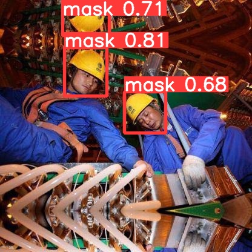

# ITRC
this project for working on Multi models to solve computer vison-based CCTV on the construction field

# Training and testing commands
#training: hardhat
python yolov5/train.py --img 416 --batch 16 --epochs 75 --data dataset/hardhat/data.yaml --cfg yolov5/models/yolov5s.yaml --weights yolov5s.pt --name hardhat_yolov5s_results

#testing
python yolov5/detect.py --weights yolov5/runs/train/hardhat_yolov5s_results2/weights/best.pt --img 416 --conf 0.5 --source dataset/hardhat/test/images/

====================================

python detect.py --source 0  # webcam
                          img.jpg  # image 
                          vid.mp4  # video
                          path/  # directory
                          path/*.jpg  # glob
                          'https://youtu.be/Zgi9g1ksQHc'  # YouTube
                          'rtsp://example.com/media.mp4'  # RTSP, RTMP, HTTP stream

#python yolov5/detect.py --weights yolov5/runs/train/hardhat_yolov5s_results2/weights/best.pt --img 416 --conf 0.5 --source dataset/hardhat/real_test/video.mp4

====================================

#training: Thermaldogpeople
python yolov5/train.py --img 416 --batch 16 --epochs 75 --data dataset/Thermaldogpeople/data.yaml --cfg yolov5/models/yolov5s.yaml --weights yolov5s.pt --name Thermaldogpeople_yolov5s_results

#testing
python yolov5/detect.py --weights yolov5/runs/train/Thermaldogpeople_yolov5s_results/weights/best.pt --img 416 --conf 0.5 --source dataset/Thermaldogpeople/test/images/

#training: Thermaldogpeople
python yolov5/train.py --img 416 --batch 16 --epochs 100 --data dataset/Mask/data.yaml --cfg yolov5/models/yolov5s.yaml --weights yolov5s.pt --name Mask_yolov5s_results

#testing
python yolov5/detect.py --weights yolov5/runs/train/Mask_yolov5s_results/weights/best.pt --img 416 --conf 0.5 --source dataset/Mask/test/images/

#testing denoising
python SwinIR/main_test_swinir.py --task color_dn --model_path SwinIR/experiments/pretrained_models/005_colorDN_DFWB_s128w8_SwinIR-M_noise20.pth --folder_gt Image_Denoise_test --noise 20

#testing sr
python SwinIR/main_test_swinir.py --task real_sr --model_path SwinIR/experiments/pretrained_models/003_realSR_BSRGAN_DFO_s64w8_SwinIR-M_x4_GAN.pth --folder_lq Image_SR_test/ --scale 4

# Visualization results
## Helmet detection

## Super - resolution

## Denoising

# reference
Yolo 5: https://github.com/ultralytics/yolov5

SwinIR: https://github.com/JingyunLiang/SwinIR